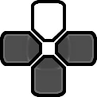

    <h1>CTW Cheat Device Reversed</h1>

    
    
    

---

Reverse Engineered **_CTW Cheat Device_** (originally by [**_qwikrazor87_**](https://github.com/qwikrazor87)).
Was made possible by using [Ghidra](https://github.com/NationalSecurityAgency/ghidra).

This is a **Work in Progress**.

---

## Why?

There's lots of reasons I wanted to start this project:
 1. This project was largely motivated by **qwikrazor87**'s death. He was a legend of the **PSP / Vita Homebrew Scene**. (Rest In Peace <3)

 2. Get to know more about **_Grand Theft Auto: Chinatown Wars_**.

 3. (In the future) Create a Remastered Edition of this menu, with complete functionality. (Not by me though)
 
 4. Learn more about decompiling PSP Games / Homebrews...

---

## Installation

> [!NOTE]
> This plugin doesn't work with PPSSPP. Only PSP and PSVita (through Adrenaline).

As this is a Reverse Engineer Project, the only release available will be the original plugin by **_qwikrazor87_**. You can find it [here](https://github.com/danssmnt/CTW-CheatDevice-Reversed/releases).

For instructions, follow the [Compiling Guide](https://github.com/danssmnt/CTW-CheatDevice-Reversed?#Compiling) from the 3rd step onwards.

---

## How to Use

 1. Play up to the mission "The Wheelman", which unlocks the car dealer.
 2. Press and hold  and  to open the menu.
 3. Select the vehicle you want to drive.
 4. Visit the **Car Dealers Garage**, north of the Gas Station in **BOABO**, where now your vehicle will now be. (Replacing the other vehicles there to buy).

---

## Running / Compiling

### Dependencies

You'll need PSPSDK to compile this plugin. We're not sure yet which version was used by qwikrazor87, so just use the latest one.

### Compiling

 1. Clone the repository, either by using ``git clone https://github.com/danssmnt/CTW-CheatDevice-Reversed``, or by going to "Code" -> "Download ZIP" and extracting it on your PC.

 2. Go inside the cloned repository and, inside a terminal, write ``make``. Some warnings might appear, don't worry, the plugin will work.
 
 3. Copy the compiled ``ctwcheatdevice.prx`` to ``ms0:/seplugins/``.
 
#### ARK-4

 4. Write ``ULUS10490 ULES01347, ms0:/seplugins/ctwcheatdevice.prx, on`` to your ``PLUGINS.TXT`` file. You can disable it on the XMB if you need.

#### Any other CFW
 
 4. Write ``ms0:/seplugins/ctwcheatdevice.prx 1`` to your ``GAME.TXT`` file. Disable it on the Recovery menu when not playing GTA: CTW.

 > [!IMPORTANT]
 > If you haven't done it yet, copy the ``ctwvehicles.txt`` file to ``ms0:/seplugins/ctw/``.

---

## Contributing

Refer to [Contributing to the Project](.github/CONTRIBUTING.md).

---

## Future Checklist
 - [X] Plugin is "identical" to original (aside from byte / instruction matching)
 - [ ] Clean Ghidra's output (aka. actually make the code readable lol)
 - [ ] Find the compiler **_qwikrazor87_** used for the original plugin
 - [ ] 100% Instruction matching the original
 - [ ] 100% Byte matching the original

---

## Acknowledgments
 - **_qwikrazor87_** (R.I.P. <3) - for creating the original plugin.
 - **_Acid_Snake_** - for finding the plugin and sharing it.
 - **_Freakler_** - for sharing the plugin.
